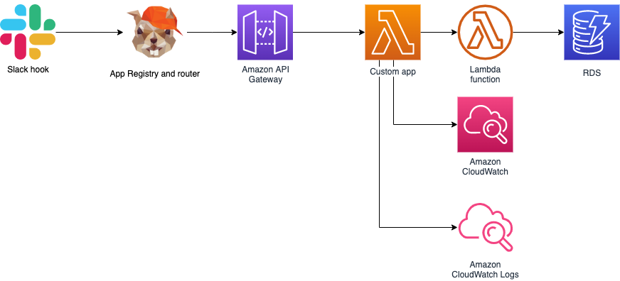

# slack-bot

This is a slack bot app named Cody. It works as an event hub and web api proxy for slack workspace. It provides 
possibility to integrate with third-party applications via REST API.

Such an approach allows connecting only one app to slack - Cody, who allows invoking and delivers output from third-party
applications.

# Architecture
Cody's architecture is not only the bot application itself, but also additional custom applications that respond to events 
sent by the slack. Everything is managed by the bot and each application must be registered.

Mentioned architecture below:




# Setup new App

Add the new freshly deployed application to Cody router, you have to know the url and events handled in the app

```
curl --location --request POST 'https://xxxxxx.execute-api.us-east-1.amazonaws.com/staging/applications' \
--header 'Content-Type: application/json' \
--header 'x-api-key: XXXXXX' \
--data-raw '{
    "name": "joke-sender-mention",
    "url": "https://zzzzzzzzzz.execute-api.us-east-1.amazonaws.com/staging/events",
    "events": ["APP_MENTION"]
}'
```

Response

```
{"message":"App registered successfully with id 19"}
```

How to check already registered application?

```
curl --location --request GET 'https://xxxxxx.execute-api.us-east-1.amazonaws.com/staging/applications' \
--header 'Content-Type: application/json' \
--header 'x-api-key: XXXXXX'
```

Response

```
{
    "applications": [
        {
            "id": "16",
            "name": "random-app-generato999999r",
            "url": "  https://zzzzzz.execute-api.us-east-1.amazonaws.com/dev/slack/events"
        },
        {
            "id": "19",
            "name": "joke-sender-mention",
            "url": "https://yyyyyy.execute-api.us-east-1.amazonaws.com/staging/events"
        }
    ]
}
```

Example event from slack, sent to registered application:

```
{
    "client_msg_id": "2542278f-0e9b-4aeb-88c7-6bf44f07c9f8",
    "type": "app_mention",
    "text": "<@U03DURBJDU6>",
    "user": "U041UK40JJJ",
    "ts": "1664797328.646279",
    "team": "T03DUG5JAAC",
    "blocks": [
        {
            "type": "rich_text",
            "block_id": "6I=7k",
            "elements": [
                {
                    "type": "rich_text_section",
                    "elements": [
                        {
                            "type": "user",
                            "user_id": "U03DURBJDU6"
                        }
                    ]
                }
            ]
        }
    ],
    "thread_ts": "1664780447.499499",
    "parent_user_id": "U03DURBJDU6",
    "channel": "C03CY4D20S2",
    "event_ts": "1664797328.646279"
}
```

## Infrastructure

Application is deployed on AWS Lambda as a couple of different functions.

